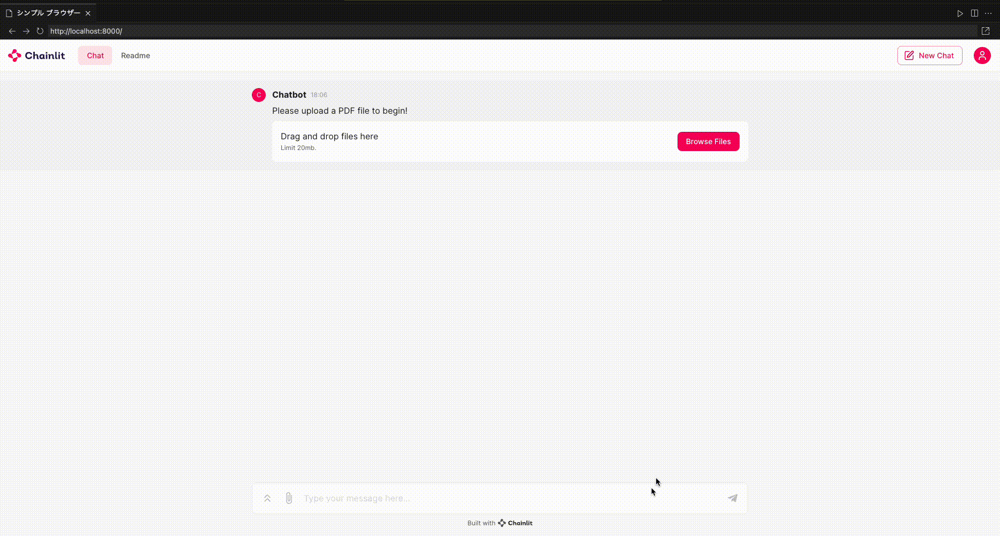
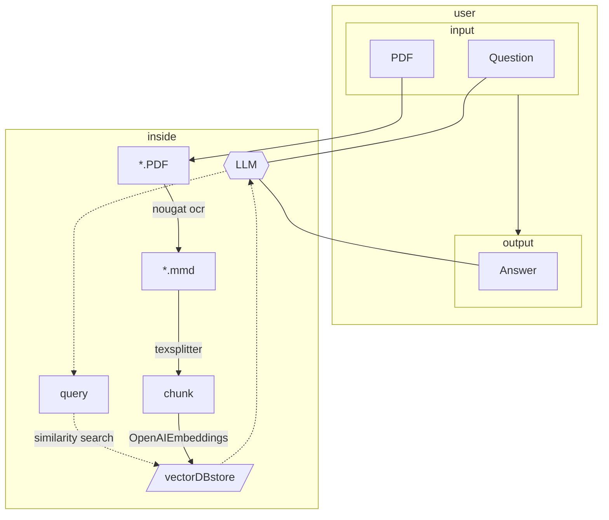

<div align="center">

# Paper Retrieval QA Chat

</div>
created by nakasone taro


  
## Demo
論文に関する問い合わせ応答（要約・質問）を可能にするチャット形式のWebアプリ  



### 前提
- gpu環境上でDockerコンテナを構築し、コンテナ内で実行するものとする。
- `docker-compose.yaml`でGPU数やポートを設定を行っているため、適宜変更すること。
- OpenAIのAPIキーを取得し、`.env`に設定すること。

### OpenAI APIキーの管理
`.env`ファイルに以下のように設定する。(`.env.exampleを参考にする)
```
OPENAI_API_KEY= "key"
```

## 実行方法
### コンテナの立ち上げ
1. コンテナのあるディレクトリ（prqa）へ移動
2. 以下のコマンドを実行してコンテナを立ち上げる
```bash
$ docker compose up -d prqa-local
```
3. 以下のコマンドでコンテナにアクセス
```bash
$ docker exec -it prqa-local bash
```
### アプリの起動
以下のコードでapp.pyを実行できる
```sh
$ chainlit run app.py
```

## アーキテクチャ

アップロードされた論文pdfファイルを英語の論文解析に特化した機械学習ベースOCR`nougat-ocr`でmmdファイルに変換し、特定のヘッダーレベルで分割、ベクトル埋め込みをベクトルDBにストアする。ユーザの質問に関して、ベクトルDBにクエリ検索を行い、関連した情報を取得して答えを返す。



## 備考

### 実行環境について
- Ubuntu: 22.04
- GPU: NVIDIA GeForce RTX 3090 x 2
- NVIDIA Driver Version: 535.171.04
- CUDA Version: 12.2
- Docker Engine: 26.1.3

### Dockerコンテナ環境について
- Python: 3.10.12
